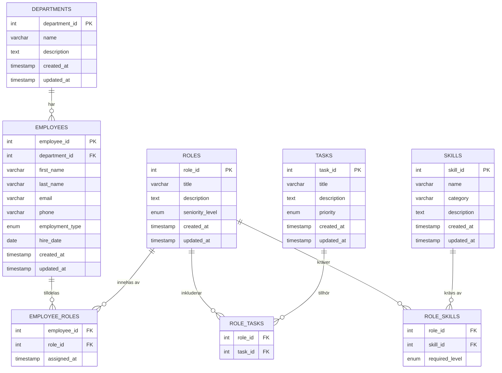

# ER-diagram — Personalhanteringssystem

## Steg 1 — Tolkning av uppgiften

### Vad uppgiften handlar om
Du ska bygga en **relationsdatabas** för ett företag som vill ha ordning på sin personal. Läraren vill se att du förstår hur man:
- identifierar vad som ska lagras (entiteter)
- kopplar ihop dem logiskt (relationer)
- ritar upp det visuellt (ER-diagram)
- bygger det tekniskt korrekt i SQL

### Vad läraren vill se — checklista för godkänt
- [ ] Tydlig kunskapsdomän (vad handlar databasen om?)
- [ ] Cirka 5 huvudentiteter
- [ ] ER-diagram (visuellt eller i textform)
- [ ] Relationer med kardinalitet (1:1, 1:N, M:N)
- [ ] Många-till-många löst med kopplingstabeller
- [ ] Rätt datatyper, PK, FK
- [ ] Metadata: `created_at`, `updated_at`
- [ ] MySQL
- [ ] Säkerhet: `.env`, `.gitignore`, prepared statements
- [ ] Projektdokument med reflektion
- [ ] Muntlig presentation

---

## Steg 2 — Databasval: MySQL

**MySQL passar bäst** för detta projekt.

**Varför:**
- All data är strukturerad och har tydliga kopplingar (anställd → avdelning, roll → uppgift)
- Relationer mellan tabeller kräver foreign keys och JOINs — det är exakt vad MySQL är byggt för
- Prepared statements för säkerhet fungerar utmärkt i MySQL
- MySQL är standard i skolmiljö och väldigt välkänt för lärare
- MongoDB hade passat bättre om datan var ostrukturerad eller dokumentbaserad — det är den inte här

---

## Steg 3 — Kunskapsdomän

**Domän:** Kompetensbaserad personalorganisation

**Problemformulering:**
Företaget har svårt att hålla koll på vilka anställda som finns, vilka roller de har, vilka avdelningar de jobbar på, vilka arbetsuppgifter som hör till varje roll och vilka kompetenser som krävs. Detta leder till otydlighet, felallokering av personal och svårigheter att hitta rätt person för rätt uppgift.

**Syfte:**
Att skapa en strukturerad databas som samlar all personalinformation på ett ställe och gör det möjligt att snabbt svara på frågor om personal, roller, kompetenser och uppgifter.

**Mål:**
- Enkelt kunna se vilka anställda som finns på varje avdelning
- Snabbt hitta vilka roller en anställd har
- Se vilka arbetsuppgifter som hör till en roll
- Identifiera vilka kompetenser som krävs för en roll
- Hitta rätt person för en specifik uppgift baserat på roll och kompetens

---

## Steg 4 — Entiteter

### 5 Huvudentiteter

| Entitet | Tabell | Varför den behövs |
|---|---|---|
| Anställd | `employees` | Kärnan — alla personer i företaget |
| Avdelning | `departments` | Organisatorisk enhet som anställda tillhör |
| Roll | `roles` | Jobbtitel/funktion (t.ex. Projektledare, Utvecklare) |
| Arbetsuppgift | `tasks` | Konkreta saker som ska göras inom en roll |
| Kompetens | `skills` | Kunskaper och förmågor som krävs för en roll |

### 3 Kopplingstabeller (löser M:N-relationer)

| Kopplningstabell | Löser relation |
|---|---|
| `employee_roles` | En anställd kan ha flera roller, en roll kan ha flera anställda |
| `role_tasks` | En roll kan ha flera uppgifter, en uppgift kan tillhöra flera roller |
| `role_skills` | En roll kan kräva flera kompetenser, en kompetens kan krävas av flera roller |

---

## Steg 5 — Relationer och kardinalitet

```
employees ──N:1──> departments
   (En anställd tillhör EN avdelning. En avdelning har MÅNGA anställda.)
   FK: employees.department_id → departments.department_id

employees <──M:N──> roles        [via employee_roles]
   (En anställd kan ha MÅNGA roller. En roll kan ha MÅNGA anställda.)
   FK: employee_roles.employee_id → employees.employee_id
   FK: employee_roles.role_id    → roles.role_id

roles <──M:N──> tasks            [via role_tasks]
   (En roll kan ha MÅNGA uppgifter. En uppgift kan tillhöra MÅNGA roller.)
   FK: role_tasks.role_id → roles.role_id
   FK: role_tasks.task_id → tasks.task_id

roles <──M:N──> skills           [via role_skills]
   (En roll kan kräva MÅNGA kompetenser. En kompetens kan krävas av MÅNGA roller.)
   FK: role_skills.role_id  → roles.role_id
   FK: role_skills.skill_id → skills.skill_id
```

### Sammanfattning av kardinalitet

| Relation | Typ | Förklaring |
|---|---|---|
| employees → departments | N:1 | Varje anställd har EN avdelning |
| employees ↔ roles | M:N | En person kan ha flera roller, t.ex. "Utvecklare" och "Teamledare" |
| roles ↔ tasks | M:N | "Projektledare" och "Teamledare" kan båda ha uppgiften "Hålla möten" |
| roles ↔ skills | M:N | "Utvecklare" kräver "Python" och "Git". "Python" kan krävas av flera roller |

---

## Steg 6 — ER-diagram

### Format 1 — Textbaserat diagram

```
┌──────────────────┐         ┌──────────────────────┐
│   departments    │         │      employees        │
├──────────────────┤         ├──────────────────────┤
│ PK department_id │◄────────│ FK department_id     │
│    name          │  N:1    │ PK employee_id        │
│    description   │         │    first_name         │
│    created_at    │         │    last_name          │
│    updated_at    │         │    email              │
└──────────────────┘         │    phone              │
                             │    employment_type    │
                             │    hire_date          │
                             │    created_at         │
                             │    updated_at         │
                             └──────────┬───────────┘
                                        │ M:N
                                        ▼
                             ┌──────────────────────┐
                             │   employee_roles     │
                             ├──────────────────────┤
                             │ FK employee_id        │
                             │ FK role_id            │
                             │    assigned_at        │
                             └──────────┬───────────┘
                                        │
                                        ▼
┌──────────────────┐         ┌──────────────────────┐
│      skills      │         │        roles         │
├──────────────────┤         ├──────────────────────┤
│ PK skill_id      │         │ PK role_id            │
│    name          │         │    title              │
│    category      │         │    description        │
│    description   │         │    seniority_level    │
│    created_at    │         │    created_at         │
│    updated_at    │         │    updated_at         │
└────────┬─────────┘         └──────────┬───────────┘
         │ M:N                          │ M:N
         ▼                              ▼
┌──────────────────┐         ┌──────────────────────┐
│   role_skills    │         │     role_tasks       │
├──────────────────┤         ├──────────────────────┤
│ FK role_id       │         │ FK role_id            │
│ FK skill_id      │         │ FK task_id            │
│    required_level│         └──────────────────────┘
└──────────────────┘                    ▲
                                        │
                             ┌──────────────────────┐
                             │        tasks         │
                             ├──────────────────────┤
                             │ PK task_id            │
                             │    title              │
                             │    description        │
                             │    priority           │
                             │    created_at         │
                             │    updated_at         │
                             └──────────────────────┘
```

### Hur du ritar det visuellt (i verktyg som draw.io, Lucidchart eller FigJam)

1. Rita en rektangel för varje tabell — skriv tabellnamnet som rubrik
2. Lista kolumnerna inuti rektangeln
3. Markera PK med fet stil eller "PK" framför
4. Markera FK med "FK" framför och dra en pil till den tabell den refererar till
5. Skriv kardinalitet vid pilens ändar: "1" vid en-sidan, "N" eller "M" vid många-sidan
6. Kopplingstabeller (employee_roles etc.) ritas som vanliga tabeller men med BARA FK-kolumner

---

## Format 2 — dbdiagram.io

Kopiera denna kod och klistra in på **dbdiagram.io** → klicka "Import" eller klistra in direkt i editorn:

```dbml
// Personalhanteringssystem - dbdiagram.io format

Table departments {
  department_id int [pk, increment, not null]
  name varchar(100) [not null, unique]
  description text
  created_at timestamp [default: `CURRENT_TIMESTAMP`]
  updated_at timestamp [default: `CURRENT_TIMESTAMP`]
}

Table employees {
  employee_id int [pk, increment, not null]
  department_id int [not null, ref: > departments.department_id]
  first_name varchar(50) [not null]
  last_name varchar(50) [not null]
  email varchar(100) [not null, unique]
  phone varchar(20)
  employment_type enum('full-time', 'part-time', 'consultant') [not null, default: 'full-time']
  hire_date date [not null]
  created_at timestamp [default: `CURRENT_TIMESTAMP`]
  updated_at timestamp [default: `CURRENT_TIMESTAMP`]
}

Table roles {
  role_id int [pk, increment, not null]
  title varchar(100) [not null]
  description text
  seniority_level enum('junior', 'mid', 'senior', 'lead') [default: 'mid']
  created_at timestamp [default: `CURRENT_TIMESTAMP`]
  updated_at timestamp [default: `CURRENT_TIMESTAMP`]
}

Table tasks {
  task_id int [pk, increment, not null]
  title varchar(150) [not null]
  description text
  priority enum('low', 'medium', 'high') [default: 'medium']
  created_at timestamp [default: `CURRENT_TIMESTAMP`]
  updated_at timestamp [default: `CURRENT_TIMESTAMP`]
}

Table skills {
  skill_id int [pk, increment, not null]
  name varchar(100) [not null, unique]
  category varchar(50)
  description text
  created_at timestamp [default: `CURRENT_TIMESTAMP`]
  updated_at timestamp [default: `CURRENT_TIMESTAMP`]
}

Table employee_roles {
  employee_id int [not null, ref: > employees.employee_id]
  role_id int [not null, ref: > roles.role_id]
  assigned_at timestamp [default: `CURRENT_TIMESTAMP`]

  indexes {
    (employee_id, role_id) [pk]
  }
}

Table role_tasks {
  role_id int [not null, ref: > roles.role_id]
  task_id int [not null, ref: > tasks.task_id]

  indexes {
    (role_id, task_id) [pk]
  }
}

Table role_skills {
  role_id int [not null, ref: > roles.role_id]
  skill_id int [not null, ref: > skills.skill_id]
  required_level enum('basic', 'intermediate', 'advanced') [default: 'intermediate']

  indexes {
    (role_id, skill_id) [pk]
  }
}
```

**Steg för steg i dbdiagram.io:**
1. Gå till [dbdiagram.io](https://dbdiagram.io)
2. Klicka på rutan till vänster och radera exempelkoden
3. Klistra in koden ovan
4. Diagrammet genereras automatiskt till höger
5. Klicka "Export" → välj "PNG" eller "PDF"
6. Spara filen som `er_diagram.png` och lägg den i mappen `docs/`

---

## Format 3 — Mermaid (för GitHub och Notion)



**Notering:** Mermaid-diagrammet kan du klistra in i GitHub-filer (.md), Notion eller på [mermaid.live](https://mermaid.live) för att se det visuellt.

---

## Export och filnamn

| Fil | Format | Filnamn | Plats |
|---|---|---|---|
| dbdiagram.io export | PNG | `er_diagram.png` | `docs/` |
| dbdiagram.io export | PDF | `er_diagram.pdf` | `docs/` |
| Mermaid (klistra in) | Markdown | (i projektdokument) | `docs/projektdokument.md` |
| Textdiagram | Markdown | (i denna fil) | `docs/er_diagram.md` |
