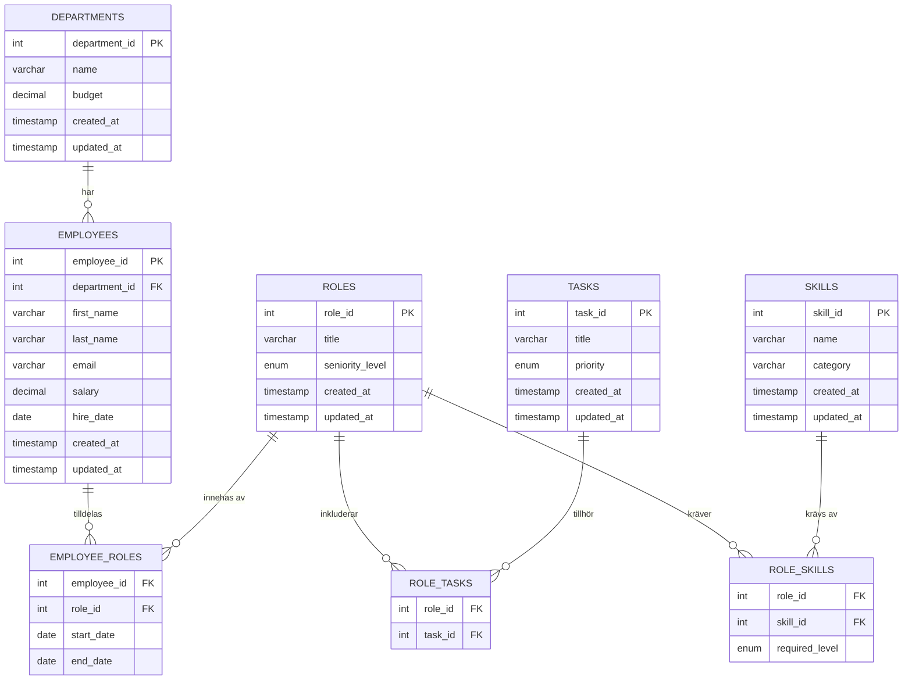

# Slutprojekt Databaser — Projektdokument

**Kurs:** Databaser  
**Datum:** 2026-04-23  
**Elev:** [Ditt namn]  
**Kunskapsdomän:** Kompetensbaserad personalorganisation

---

## 1. Titel

**Personalhanteringssystem — en relationsdatabas för kompetensbaserad personalorganisation**

---

## 2. Kunskapsdomän

Kunskapsdomänen för detta projekt är **kompetensbaserad personalorganisation**. Det handlar om hur ett företag strukturerar och håller koll på sina anställda, deras roller, vilka avdelningar de tillhör, vilka arbetsuppgifter som hör till varje roll och vilka kompetenser som krävs.

Det är ett avgränsat område med tydliga kopplingar mellan alla delar, vilket gör det väl lämpat för en relationsdatabas.

---

## 3. Problemformulering

Många företag har svårt att hålla ordning på sin personal. Information om vem som jobbar var, vilka roller olika medarbetare har och vilka kompetenser som finns i organisationen sprids ofta över e-post, kalkylark och informella samtal. Det leder till:

- Otydlighet om vem som ansvarar för vad
- Svårigheter att hitta rätt person för en uppgift
- Risk för dubbelarbete eller att viktiga uppgifter faller mellan stolarna
- Ingen tydlig bild av vilka kompetenser som saknas

**Databasprojektets problem att lösa:** Hur kan vi strukturera personalinformation så att företaget enkelt kan svara på frågorna — vem jobbar var, i vilken roll, med vilka uppgifter och med vilka kompetenser?

---

## 4. Syfte

Syftet med databasen är att samla all relevant personalinformation på ett strukturerat ställe och göra det möjligt att snabbt och korrekt besvara frågor om organisationens personal, roller, uppgifter och kompetenser.

---

## 5. Mål

Databasen ska kunna svara på följande frågor:

1. Vilka anställda jobbar på en viss avdelning?
2. Vilka roller har en specifik anställd?
3. Vilka arbetsuppgifter hör till en viss roll?
4. Vilka kompetenser krävs för en viss roll?
5. Vem i företaget kan utföra en specifik arbetsuppgift?
6. Hur ser lönefördelningen ut per avdelning?
7. Vilka anställda har mer än en aktiv roll?
8. Vilka kompetenser saknar vi (har ingen kopplad roll)?

---

## 6. Entiteter och attribut

### Huvudentitet 1: employees (Anställda)

| Kolumn | Datatyp | Constraint | Förklaring |
|---|---|---|---|
| employee_id | INT | PK, AUTO_INCREMENT | Unikt ID |
| department_id | INT | FK, NOT NULL | Vilken avdelning |
| first_name | VARCHAR(50) | NOT NULL | Förnamn |
| last_name | VARCHAR(50) | NOT NULL | Efternamn |
| email | VARCHAR(100) | NOT NULL, UNIQUE | E-post (unik) |
| phone | VARCHAR(20) | — | Telefon |
| employment_type | ENUM | NOT NULL | 'full-time', 'part-time', 'consultant' |
| salary | DECIMAL(10,2) | NOT NULL | Lön — **numeriskt attribut** |
| hire_date | DATE | NOT NULL | Anställningsdatum — **datumattribut** |
| created_at | TIMESTAMP | DEFAULT NOW() | Metadata |
| updated_at | TIMESTAMP | ON UPDATE NOW() | Metadata |

### Huvudentitet 2: departments (Avdelningar)

| Kolumn | Datatyp | Constraint | Förklaring |
|---|---|---|---|
| department_id | INT | PK, AUTO_INCREMENT | Unikt ID |
| name | VARCHAR(100) | NOT NULL, UNIQUE | Avdelningsnamn |
| description | TEXT | — | Beskrivning |
| budget | DECIMAL(12,2) | NOT NULL | Budget — **numeriskt attribut** |
| created_at | TIMESTAMP | DEFAULT NOW() | Metadata |
| updated_at | TIMESTAMP | ON UPDATE NOW() | Metadata |

### Huvudentitet 3: roles (Roller)

| Kolumn | Datatyp | Constraint | Förklaring |
|---|---|---|---|
| role_id | INT | PK, AUTO_INCREMENT | Unikt ID |
| title | VARCHAR(100) | NOT NULL, UNIQUE | Rolltitel |
| description | TEXT | — | Beskrivning |
| seniority_level | ENUM | NOT NULL | 'junior', 'mid', 'senior', 'lead' |
| created_at | TIMESTAMP | DEFAULT NOW() | Metadata |
| updated_at | TIMESTAMP | ON UPDATE NOW() | Metadata |

### Huvudentitet 4: tasks (Arbetsuppgifter)

| Kolumn | Datatyp | Constraint | Förklaring |
|---|---|---|---|
| task_id | INT | PK, AUTO_INCREMENT | Unikt ID |
| title | VARCHAR(150) | NOT NULL | Uppgiftsnamn |
| description | TEXT | — | Beskrivning |
| priority | ENUM | NOT NULL | 'low', 'medium', 'high' |
| created_at | TIMESTAMP | DEFAULT NOW() | Metadata |
| updated_at | TIMESTAMP | ON UPDATE NOW() | Metadata |

### Huvudentitet 5: skills (Kompetenser)

| Kolumn | Datatyp | Constraint | Förklaring |
|---|---|---|---|
| skill_id | INT | PK, AUTO_INCREMENT | Unikt ID |
| name | VARCHAR(100) | NOT NULL, UNIQUE | Kompetensnamn |
| category | VARCHAR(50) | — | Kategori (t.ex. "Programmering") |
| description | TEXT | — | Beskrivning |
| created_at | TIMESTAMP | DEFAULT NOW() | Metadata |
| updated_at | TIMESTAMP | ON UPDATE NOW() | Metadata |

### Kopplingstabeller (löser M:N-relationer)

**employee_roles** — Anställd ↔ Roll:
- FK employee_id, FK role_id, start_date (DATE), end_date (DATE NULL), assigned_at
- *start_date och end_date = datumattribut som visar när rollen var aktiv*

**role_tasks** — Roll ↔ Arbetsuppgift:
- FK role_id, FK task_id

**role_skills** — Roll ↔ Kompetens:
- FK role_id, FK skill_id, required_level (ENUM)

---

## 7. Relationer och kardinalitet

| Relation | Kardinalitet | Förklaring |
|---|---|---|
| employees → departments | **N:1** | En anställd tillhör en avdelning. En avdelning har många anställda. |
| employees ↔ roles | **M:N** | En anställd kan ha flera roller. En roll kan innehas av flera anställda. Löst via `employee_roles`. |
| roles ↔ tasks | **M:N** | En roll kan ha flera uppgifter. En uppgift kan tillhöra flera roller. Löst via `role_tasks`. |
| roles ↔ skills | **M:N** | En roll kan kräva flera kompetenser. En kompetens kan krävas av flera roller. Löst via `role_skills`. |

---

## 8. ER-diagram

### Mermaid-format (kan klistras in i GitHub eller Notion)



*Se även `docs/er_diagram.md` för fullständigt diagram i textformat och dbdiagram.io-format.*
*Se `docs/er_diagram.png` för visuellt diagram exporterat från dbdiagram.io.*

---

## 9. Normalformsanalys (3NF)

För att uppfylla 3NF måste databasen uppfylla tre regler:

### 1NF — Första normalformen
Alla celler ska ha atomära (odelbara) värden. Inga upprepade grupper.

**Uppfyllt:** Varje kolumn innehåller ett enda värde. Exempelvis lagras inte "Python, JavaScript" i en cell — i stället finns en separat `skills`-tabell med en rad per kompetens.

### 2NF — Andra normalformen
Alla icke-nyckel-attribut ska bero på hela primärnyckeln (inget partiellt beroende).

**Uppfyllt:** I enkelnyckel-tabeller (employees, departments etc.) beror alla kolumner direkt på PK (employee_id, department_id). I kopplingstabeller med composite PK (t.ex. employee_roles med PK = employee_id + role_id) beror start_date på HELA composite PK, inte bara på en del av den.

### 3NF — Tredje normalformen
Inga transitiva beroenden. Icke-nyckel-attribut ska inte bero på andra icke-nyckel-attribut.

**Uppfyllt:** I `employees` beror t.ex. `first_name` och `salary` direkt på `employee_id`, inte via `department_id`. Avdelningsinformation lagras i en separat tabell och kopplas via FK. Om avdelningens namn ändras behöver vi bara uppdatera en rad i `departments`, inte alla rader i `employees`.

**Konkret exempel på 3NF-brott som vi undvikit:**
Om vi hade lagt `department_name` direkt i `employees`-tabellen hade vi brutit mot 3NF — `department_name` hade berott på `department_id`, inte direkt på `employee_id`. I stället är `department_id` en FK och avdelningsnamnet hämtas via JOIN.

---

## 10. Tekniska val

| Val | Teknik | Motivering |
|---|---|---|
| Databas | MySQL 8.x | Välkänd, stöder FK, transactions och prepared statements. Passar strukturerad relationsdata. |
| Backend | Node.js | Enkelt att koppla till MySQL, välkänt i skolmiljö. |
| MySQL-bibliotek | mysql2 | Stöder async/await och prepared statements med `execute()`. |
| Miljövariabler | dotenv | Standard för att hantera känslig konfiguration utan hårdkodning. |
| Charset | utf8mb4 | Stöder svenska tecken (å, ä, ö) och emoji. |

---

## 11. Säkerhet

### .env-fil
All känslig konfiguration (databasanslutning, lösenord) lagras i en `.env`-fil som aldrig committeras till git.

**Innehåll i `.env`:**
```
DB_HOST=localhost
DB_PORT=3306
DB_USER=root
DB_PASSWORD=ditt_lösenord
DB_NAME=company_db
```

### .gitignore
`.env` är listad i `.gitignore` och syns inte i `git status`.

### Prepared Statements
All SQL körs med `connection.execute(sql, [params])` från `mysql2`. Parametrar skickas separat och aldrig interpolerade i SQL-strängen. Detta förhindrar SQL injection.

**Exempel på RÄTT sätt:**
```javascript
// RÄTT — prepared statement
const [rows] = await pool.execute(
  'SELECT * FROM employees WHERE employee_id = ?',
  [id]
);
```

**Exempel på FARLIGT sätt (används INTE i projektet):**
```javascript
// FEL — sårbar för SQL injection
const sql = `SELECT * FROM employees WHERE employee_id = ${id}`;
```

### Input-validering
Indata valideras i model-filerna innan SQL körs:
- E-post måste innehålla `@`
- Lön måste vara ett positivt tal
- ID:n kontrolleras som siffror

---

## 12. MongoDB-översättning

*Se `db/mongodb_queries.js` för fullständig MongoDB-implementation.*

I MongoDB representeras data som **dokument** (JSON-liknande) istället för tabeller och rader. Det finns inga foreign keys — i stället kan man **embeda** (bädda in) eller **referera** med ID:n.

### Hur personaldata representeras i MongoDB

**Collection: employees**
```json
{
  "_id": ObjectId("..."),
  "first_name": "Amira",
  "last_name": "Lindqvist",
  "email": "amira.lindqvist@company.se",
  "salary": 42000,
  "hire_date": ISODate("2021-03-15"),
  "department": "IT & Utveckling",
  "roles": [
    { "title": "Systemutvecklare", "start_date": ISODate("2021-03-15") },
    { "title": "Teamledare",       "start_date": ISODate("2023-01-01") }
  ]
}
```

I MySQL hade roller lagrats i separata tabeller med FK. I MongoDB embedas de direkt i dokumentet om de läses ihop ofta.

---

## 13. Projektstruktur

```
Structure.2.0/
├── db/
│   ├── schema.sql             — Alla CREATE TABLE-kommandon
│   ├── seed.sql               — Testdata (INSERT INTO)
│   ├── queries.sql            — 12 exempelfrågor
│   └── mongodb_queries.js     — MongoDB-implementation
├── docs/
│   ├── er_diagram.md          — ER-diagram i tre format
│   ├── figjam_plan.md         — FigJam-guide
│   ├── projektdokument.md     — Detta dokument
│   ├── reflektion.md          — Reflektion
│   ├── muntlig_forberedelse.md— Muntlig förberedelse
│   └── checklista.md          — Projektkrav-checklista
├── src/
│   ├── config/
│   │   └── db.js              — Databasanslutning
│   ├── models/
│   │   ├── employee.js        — CRUD för anställda
│   │   ├── department.js      — Queries för avdelningar
│   │   ├── role.js            — Queries för roller
│   │   ├── task.js            — Queries för uppgifter
│   │   └── skill.js           — Queries för kompetenser
│   └── index.js               — Demo av alla queries
├── .env.example               — Mall för miljövariabler
├── .gitignore                 — Exkluderar .env och node_modules
└── package.json               — Node.js-konfiguration
```
